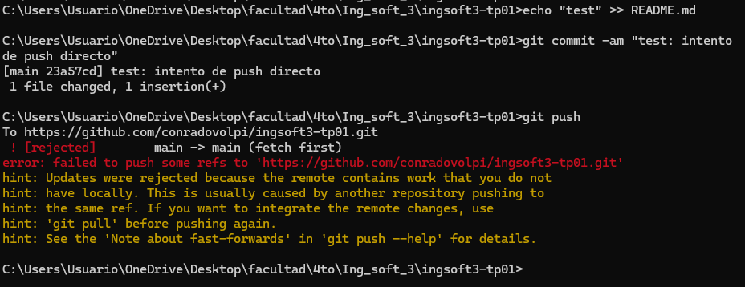
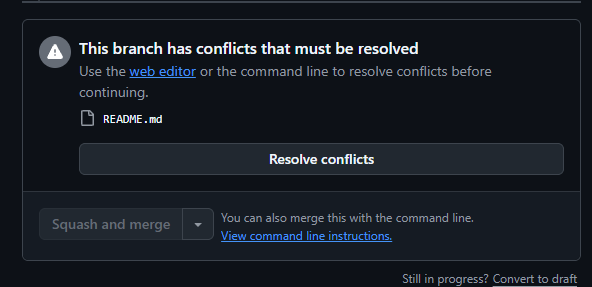
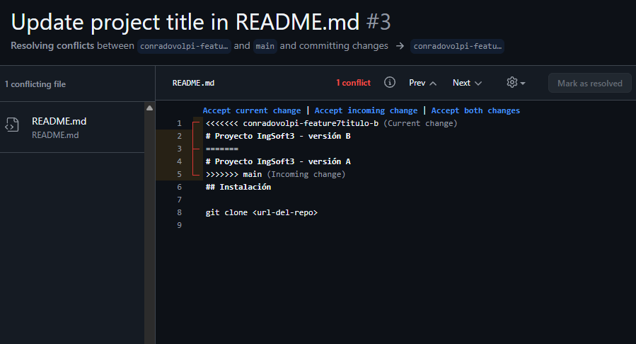
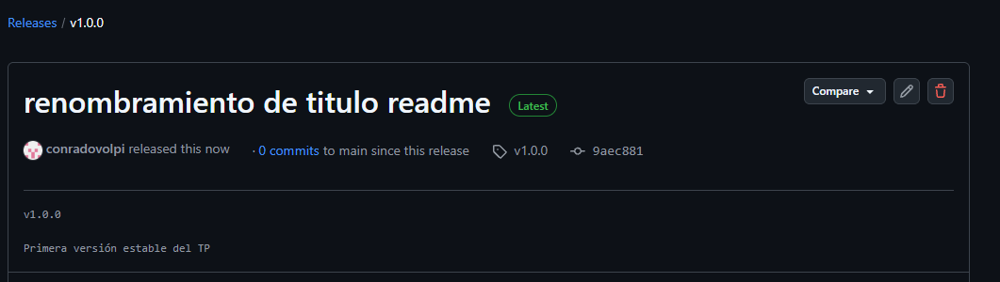

# Evidencias — TP1

## 1. Push directo a main rechazado

GitHub rechaza el push porque main está protegida y la regla alcanza también al dueño del repo.

## 2. El PR de la rama B no se puede mergear: conflicto

Escribe aquí la línea explicativa de lo que se observa en esta captura.

## 3. Tercera evidencia

Descripción breve de esta captura.

## 4. Cuarta evidencia

Descripción breve de esta captura.

## TP2 — Contenedores

### 1. Sistema completo levantado con Docker Compose

Se ejecutó:

```bash
docker compose up -d --build
```

y se verificó el estado con:

```bash
docker compose ps
```

Los tres servicios quedaron en ejecución:

* `misgastos-db`
* `misgastos-backend`
* `misgastos-frontend`

La base de datos MySQL quedó en estado `healthy`.

También se verificó el funcionamiento de la API a través del frontend/nginx mediante:

```bash
curl http://localhost:3000/api/expenses
```

La solicitud devolvió correctamente los gastos almacenados en la base de datos.

La aplicación completa quedó accesible desde:

```text
http://localhost:3000
```

### 2. Prueba de persistencia

Se verificó la persistencia del volumen de MySQL.

Primero se cargaron datos en la aplicación y luego se ejecutó:

```bash
docker compose down
docker compose up -d
```

Después de recrear los contenedores, los registros continuaban disponibles.

Luego se ejecutó:

```bash
docker compose down -v
docker compose up -d
```

En este caso los datos fueron eliminados, debido a que la opción `-v` también elimina el volumen utilizado por MySQL.

Esto demuestra que los datos no dependen de la capa efímera del contenedor, sino del volumen nombrado `mysql_data`.

### 3. Comparación de tamaño de imágenes

Se compararon las imágenes utilizadas para compilar y ejecutar el backend.

Resultados obtenidos:

```text
mcr.microsoft.com/dotnet/sdk:10.0       1.25 GB
mcr.microsoft.com/dotnet/aspnet:10.0    340 MB
misgastos-backend                       350 MB
```

El SDK de .NET se utiliza únicamente durante la etapa de compilación.

La imagen final parte del runtime ASP.NET y contiene solamente lo necesario para ejecutar la aplicación, por lo que no incorpora el SDK completo.

Para el frontend, la imagen final obtenida fue:

```text
misgastos-frontend    93.7 MB
```

Node se utiliza únicamente para construir el frontend y nginx queda como servidor en la imagen final.

### 4. Imágenes publicadas en GitHub Container Registry

Se publicaron las imágenes:

```text
ghcr.io/conradovolpi/misgastos-backend:v0.1.0
ghcr.io/conradovolpi/misgastos-frontend:v0.1.0
```

Ambas fueron configuradas con visibilidad pública.

Para verificar que realmente fueran públicas se ejecutó:

```bash
docker logout ghcr.io
```

Luego se eliminaron los tags locales y se realizó:

```bash
docker pull ghcr.io/conradovolpi/misgastos-backend:v0.1.0
docker pull ghcr.io/conradovolpi/misgastos-frontend:v0.1.0
```

Las dos imágenes pudieron descargarse correctamente sin autenticación.

### 5. Ejecución mediante imágenes del registry

Se creó `docker-compose.registry.yml`, reemplazando las construcciones locales del backend y frontend por las imágenes publicadas en GHCR.

Se ejecutó:

```bash
docker compose -f docker-compose.registry.yml up -d
```

El sistema levantó correctamente sin utilizar `build:` para backend y frontend.

También se verificó nuevamente el funcionamiento de la aplicación desde:

```text
http://localhost:3000
```

La comunicación frontend → backend → MySQL funcionó correctamente utilizando las imágenes publicadas.
